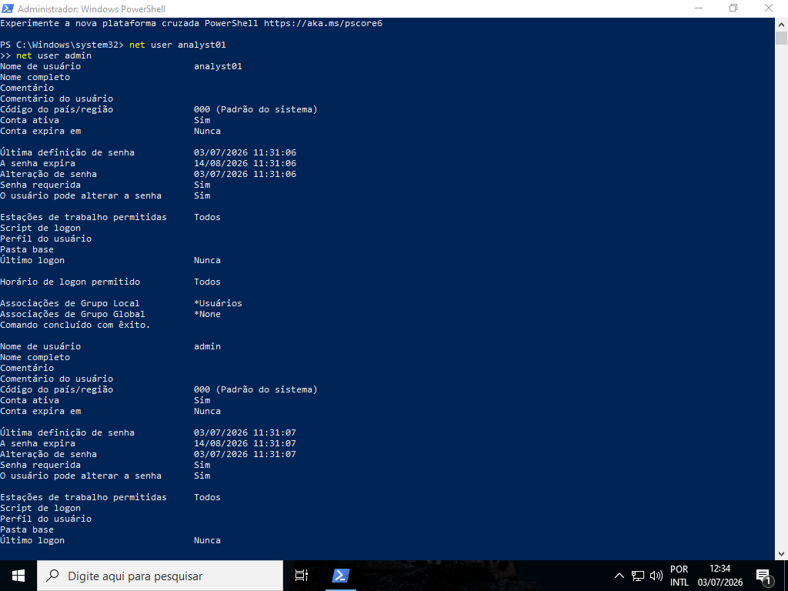
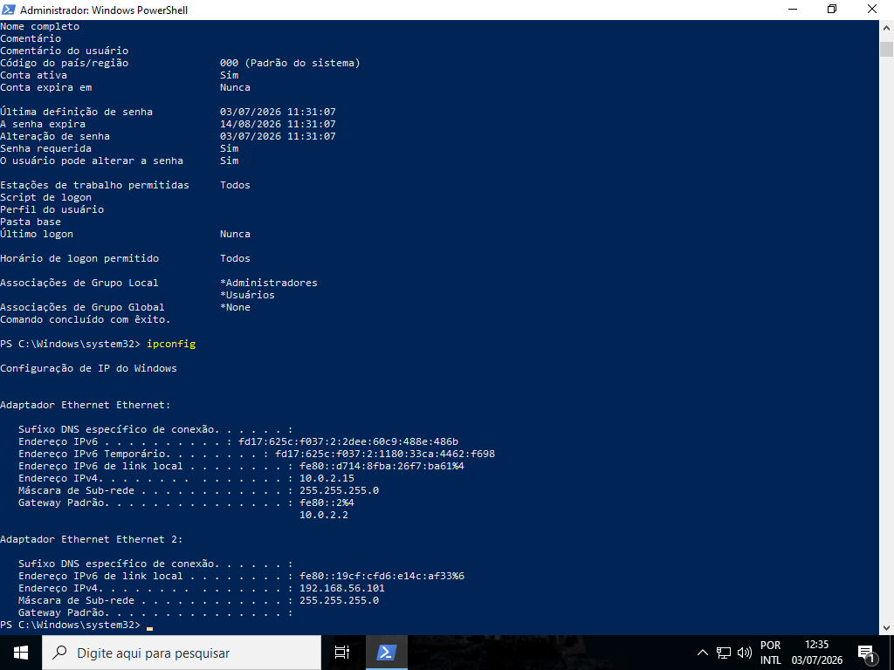
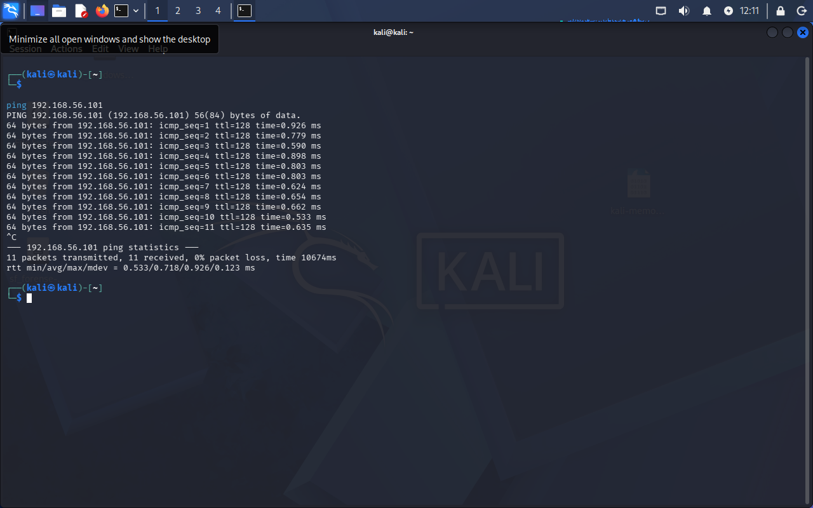
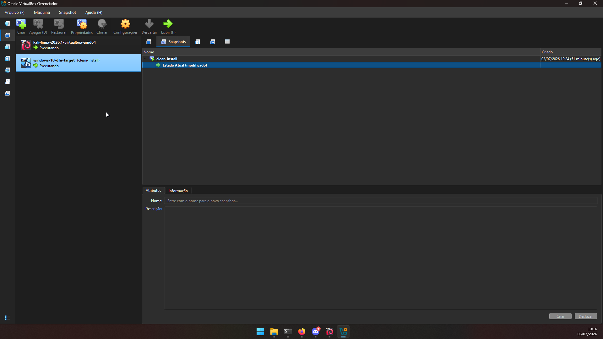

# Phase 00 — Environment Setup

## Objective

Configure the forensic laboratory environment for the NexChain Exchange insider threat investigation. This phase establishes the two-VM setup, network connectivity between investigator and target machines, user accounts representing the attacker and administrator roles, and a clean baseline snapshot before any attack simulation begins.

---

## Lab Architecture

```
┌─────────────────────────────────────────────────────┐
│                   HOST (Windows)                     │
│              Ryzen 7 5700X · 32GB RAM                │
│                  VirtualBox 7.2.8                    │
│                                                      │
│  ┌──────────────────┐    ┌──────────────────────┐   │
│  │   NEXCHAIN-WS01  │    │  kali-linux-2026.1   │   │
│  │  Windows 10 LTSC │    │   Kali Linux 2026.1  │   │
│  │                  │    │                      │   │
│  │  NAT: 10.0.2.15  │    │  eth1: 192.168.56.102│   │
│  │  Host-only:      │    │                      │   │
│  │  192.168.56.101  │    │  Investigator VM     │   │
│  │                  │    │                      │   │
│  │  Target VM       │    │  Tools: Volatility 3 │   │
│  └──────────────────┘    │  Autopsy · TSK       │   │
│                          └──────────────────────┘   │
│                                                      │
│         Host-only network: 192.168.56.0/24           │
└─────────────────────────────────────────────────────┘
```

---

## Target VM Specifications

| Field | Value |
|---|---|
| VM Name | `windows-10-dfir-target` |
| Hostname | `NEXCHAIN-WS01` |
| Operating System | Windows 10 Enterprise LTSC 21H2 (10.0.19044.1288) |
| RAM | 8 GB |
| CPUs | 4 |
| Disk | 60 GB dynamic VDI |
| NIC 1 | NAT — 10.0.2.15 (internet access) |
| NIC 2 | Host-only — 192.168.56.101 (static, investigator network) |
| Hypervisor | VirtualBox 7.2.8 r173730 |

## Investigator VM Specifications

| Field | Value |
|---|---|
| VM Name | `kali-linux-2026.1-virtualbox-amd64` |
| Operating System | Kali Linux 2026.1 (kernel 6.18.12+kali-amd64) |
| RAM | 4 GB |
| CPUs | 2 |
| NIC | Host-only — 192.168.56.102 |
| Tools installed | Volatility 3 (v2.28.1) · Autopsy 4.23.1 · TSK 4.14.0 · ewfacquire 20140816 |

---

## Step 1 — Windows 10 Installation and Guest Additions

Windows 10 Enterprise LTSC 21H2 was installed from scratch on the target VM. After installation, VirtualBox Guest Additions were installed to enable bidirectional clipboard between host and VM.

Guest Additions installer: `VBoxWindowsAdditions-amd64.exe` (64-bit)

After installation and reboot, clipboard was set to bidirectional via VirtualBox menu: **Devices → Shared Clipboard → Bidirectional**.

---

## Step 2 — User Account Creation

Two user accounts were created to separate the attacker role from the administrator role:

| Account | Role | Group |
|---|---|---|
| `analyst01` | Attacker (simulated insider threat) | Users (standard) |
| `admin` | Local administrator | Administrators |

```powershell
net user analyst01 "P@ssw0rd123!" /add
net user admin "Adm1n@2026!" /add
net localgroup Administradores admin /add
```



`analyst01` is a standard user with no administrative privileges — consistent with a typical compliance analyst account at a financial institution. `admin` holds local administrator rights and will be used for environment configuration only, never during the attack simulation phase.

---

## Step 3 — Network Configuration

The target VM was configured with two network adapters:

**NIC 1 — NAT (Ethernet):** Provides internet access for software installation. Assigned automatically by VirtualBox DHCP: `10.0.2.15`.

**NIC 2 — Host-only (Ethernet 2):** Provides isolated communication between the target VM and the Kali investigator VM. Static IP configured manually:

```powershell
netsh interface ip set address name="Ethernet 2" static 192.168.56.101 255.255.255.0
```

An inbound ICMPv4 firewall rule was added to allow ping from the investigator VM:

```powershell
netsh advfirewall firewall add rule name="ICMPv4-In" protocol=icmpv4:8,any dir=in action=allow
```



---

## Step 4 — Connectivity Verification

Network connectivity between the Kali investigator VM and the Windows target was verified by pinging `192.168.56.101` from Kali:

```bash
ping 192.168.56.101
```



11 packets transmitted, 11 received, 0% packet loss. The investigator VM can reach the target system over the host-only network.

---

## Step 5 — Clean Baseline Snapshot

Before any attack simulation or evidence generation, a snapshot of the clean Windows installation was taken. This snapshot preserves the unmodified baseline state and allows the environment to be restored if needed.

**Snapshot name:** `clean-install`
**Created:** 2026-07-03 12:24 BRT



This snapshot is the forensic baseline for the investigation. All evidence generated during the attack simulation (Phase 01) will exist in the differential VDI created after this snapshot, not in the base disk — a lesson explicitly learned and documented during the BitTorrent DFIR investigation (BTD-2026-001).

---

## Volatility 3 — Installation on Investigator VM

In parallel with the target VM setup, Volatility 3 was installed on the Kali investigator VM for memory forensics in Phase 03.

```bash
git clone https://github.com/volatilityfoundation/volatility3.git ~/tools/volatility3
cd ~/tools/volatility3
python3 vol.py -h
```

**Version confirmed:** Volatility 3 Framework 2.28.1

Installation was verified by running `banners.Banners` against a test memory dump of the Kali VM itself, generated via:

```powershell
# Executed on Windows host
& "C:\Program Files\Oracle\VirtualBox\VBoxManage.exe" debugvm "kali-linux-2026.1-virtualbox-amd64" dumpvmcore --filename "C:\Users\Paulo Vaz\Desktop\kali-memory.dmp"
```

Volatility correctly identified the kernel banner (`Linux version 6.18.12+kali-amd64`) from the dump, confirming the tool is operational. Windows symbol tables required for Phase 03 analysis will be downloaded automatically by Volatility on first use against the Windows target dump.

---

## Environment Summary

| Component | Status |
|---|---|
| Target VM (NEXCHAIN-WS01) | ✅ Installed and configured |
| Guest Additions | ✅ Installed, clipboard bidirectional |
| User `analyst01` | ✅ Created (standard user) |
| User `admin` | ✅ Created (local administrator) |
| Static IP 192.168.56.101 | ✅ Configured on Ethernet 2 |
| ICMPv4 firewall rule | ✅ Enabled |
| Kali → Windows connectivity | ✅ Verified (0% packet loss) |
| Volatility 3 v2.28.1 | ✅ Installed on Kali |
| Baseline snapshot `clean-install` | ✅ Taken before any activity |

---

*Phase 00 — ITI-2026-001 — NexChain Exchange Insider Threat Investigation*

**Next:** [Phase 01 — Attack Simulation](../phase01-attack-simulation/README.md)
