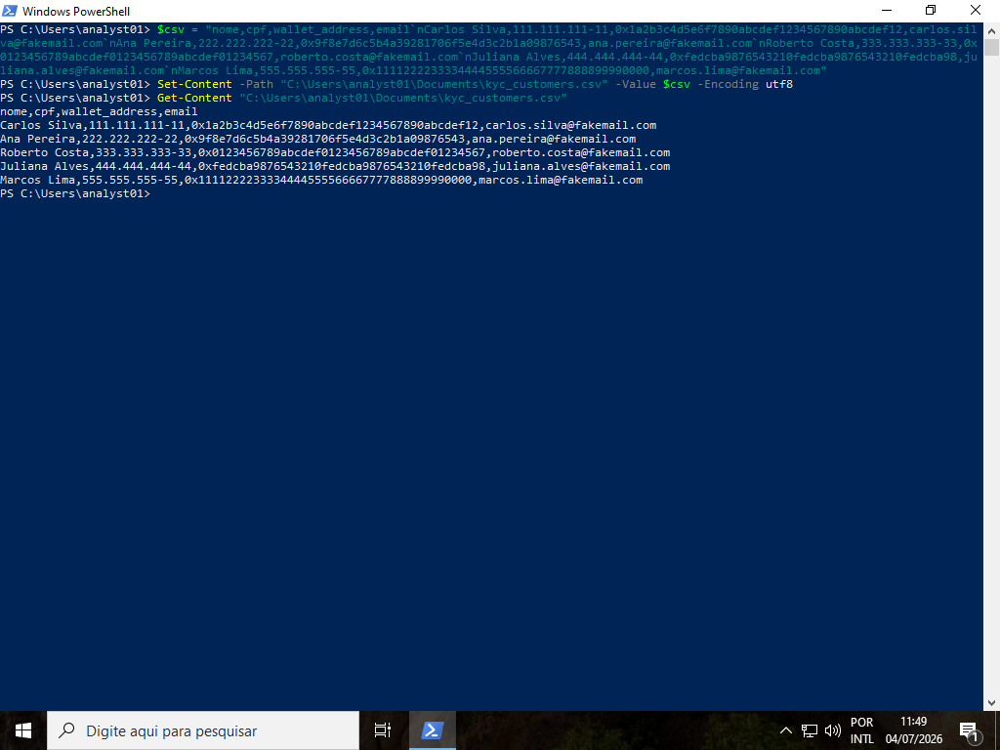
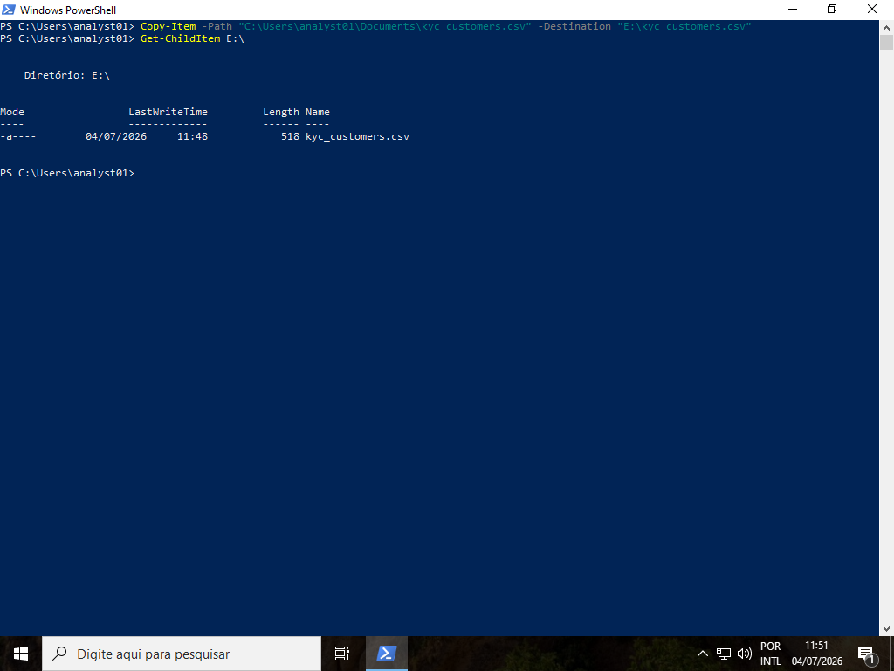
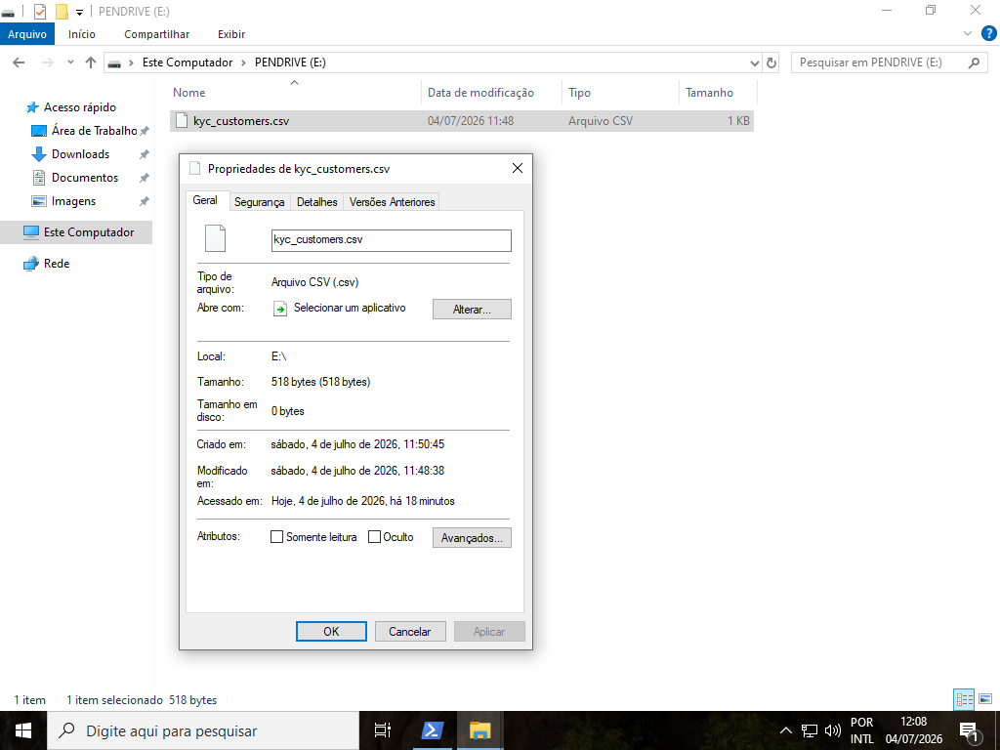
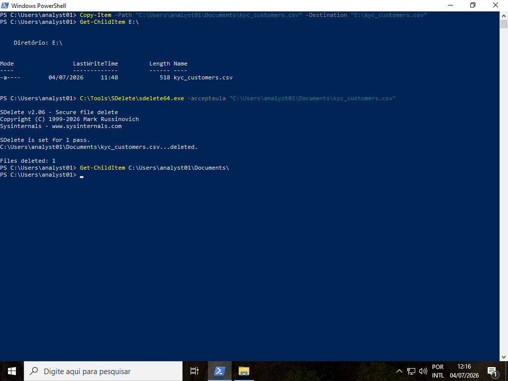
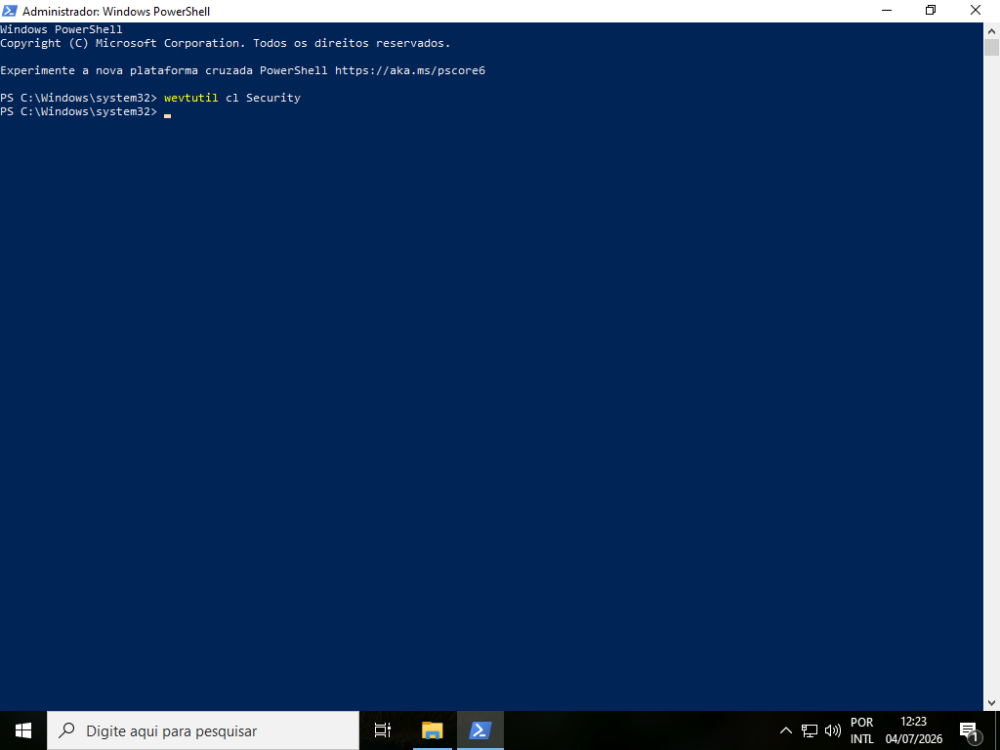
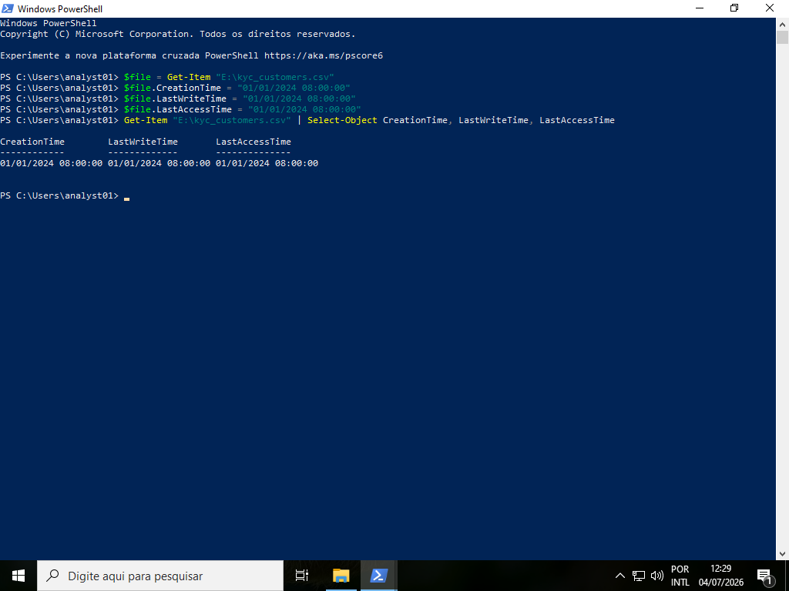
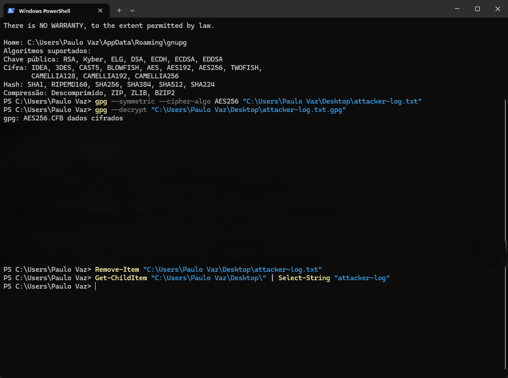
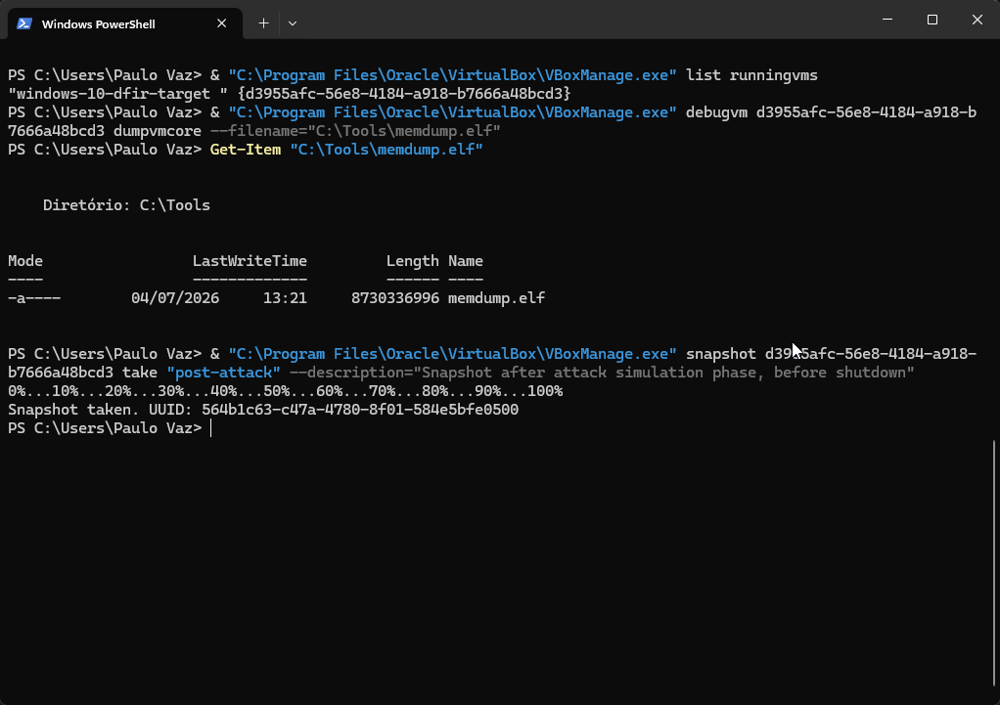

# Phase 01 — Attack Simulation

## Objective

Simulate the actions of a malicious insider — a compliance analyst at NexChain Exchange — exfiltrating customer KYC data to an external device and attempting to cover their tracks using anti-forensic techniques. All actions were performed from the attacker's perspective and documented in a sealed, GPG-encrypted log, kept separate from the investigation itself to preserve investigator objectivity (blind analysis, compared against findings in Phase 07).

This phase departs from every previous project in the portfolio: instead of generating evidence and immediately investigating it, the investigator (Paulo Vaz) intentionally created a gap between the attacker's actions and the forensic analysis. What was found — and what was missed — becomes part of the final report.

---

## Attacker Context

| Field | Value |
|---|---|
| Account used | `analyst01` (standard user, no admin privileges) |
| Target VM | `windows-10-dfir-target` (NEXCHAIN-WS01) |
| Scenario | Compliance analyst exfiltrating KYC data prior to resignation |
| Simulated external device | VHD mounted as removable disk (`E:\`, label `PENDRIVE`) |
| Anti-forensic tools used | SDelete (Sysinternals), `wevtutil`, PowerShell timestomping |

> **Standards note.** This phase is executed from the **attacker's perspective** — it generates the incident rather than investigating it. The forensic standards that govern the rest of this project (ISO/IEC 27037, 27041, 27042, etc.) apply to the *investigation* of evidence, not to its creation, and therefore do not apply here. One regulatory dimension is, however, relevant: the data handled in this scenario — customer names, Brazilian national identifiers (CPF), and cryptocurrency wallet addresses — constitutes **personal data** under Brazil's **LGPD** (Lei Geral de Proteção de Dados). The simulated exfiltration recreates precisely the kind of personal-data breach the LGPD regulates, which is what gives the downstream investigation its regulatory significance (developed further in the forensic report and the final project README).

---

## Step 1 — Simulated Removable Device (VHD)

A 1GB dynamic VHD was created and mounted directly inside the target VM (not shared from the host) to generate authentic removable-device artifacts in the Windows Registry (`USBSTOR`, `MountedDevices`) — exactly what the investigator will look for in Phase 04.

```
diskpart
create vdisk file="C:\Tools\pendrive.vhd" maximum=1024 type=expandable
select vdisk file="C:\Tools\pendrive.vhd"
attach vdisk
create partition primary
format fs=ntfs quick label="PENDRIVE"
assign
```

Result: volume `E:` (`PENDRIVE`, NTFS, 1022 MB) mounted and ready.

---

## Step 2 — KYC Data Creation and Exfiltration

A fictitious KYC dataset (customer names, fake CPFs, fake wallet addresses, emails) was generated directly inside the `analyst01` session — not transferred from the host — so that file creation metadata is consistent with genuine on-machine activity rather than artifacts of a file transfer.

```powershell
$csv = "nome,cpf,wallet_address,email`n..."
Set-Content -Path "C:\Users\analyst01\Documents\kyc_customers.csv" -Value $csv -Encoding utf8
```



The file was then copied to the simulated external device:

```powershell
Copy-Item -Path "C:\Users\analyst01\Documents\kyc_customers.csv" -Destination "E:\kyc_customers.csv"
```



Baseline timestamps of the file (before any anti-forensic tampering) were recorded for later comparison:



---

## Step 3 — Anti-Forensic Countermeasures

Three anti-forensic techniques were applied, simulating an attacker attempting to cover their tracks.

### 3.1 — Secure deletion (SDelete)

The original file in `Documents` was securely deleted (1-pass overwrite) using Sysinternals SDelete:

```powershell
C:\Tools\SDelete\sdelete64.exe -accepteula "C:\Users\analyst01\Documents\kyc_customers.csv"
```



### 3.2 — Windows Event Log clearing attempt

The Security event log was cleared using `wevtutil`, executed with administrator privileges:

```powershell
wevtutil cl Security
```



Note: this action, even if it succeeds in wiping the log's contents, generates **Event ID 1102** ("The audit log was cleared") — automatically logged by Windows itself. This is expected to become one of the key findings in Phase 05 (Anti-Forensic Analysis): the attacker's attempt to erase evidence is itself evidence.

### 3.3 — Timestomping

Timestamps of the copied file on `E:\` were altered to a false date, attempting to disguise when the exfiltration actually occurred:

```powershell
$file = Get-Item "E:\kyc_customers.csv"
$file.CreationTime = "01/01/2024 08:00:00"
$file.LastWriteTime = "01/01/2024 08:00:00"
$file.LastAccessTime = "01/01/2024 08:00:00"
```



This modifies the NTFS `$STANDARD_INFORMATION` ($SI) attribute, which is straightforward to alter via the Windows API. The `$FILE_NAME` ($FN) attribute, harder to tamper with, is expected to still reflect the true creation time — the $SI vs $FN discrepancy is the classic timestomping fingerprint to be confirmed in Phase 05.

---

## Step 4 — Sealed Attacker Log

All actions above were documented in real time, with exact timestamps, in a plaintext log kept on the **host** (outside the VM) — deliberately separate from the investigator's future analysis.

```
11:45 - 04/07/2026
"VHD montado como unidade E:, label PENDRIVE, 1022 MB"
Comando usado (create vdisk + attach + create partition + format + assign)

12:06 - 04/07/2026
"Arquivo kyc_customers.csv copiado de Documents para E:\ (pendrive simulado)"

12:16 - 04/07/2026
"sdelete executado em C:\Users\analyst01\Documents\kyc_customers.csv (1 pass overwrite) — arquivo original removido"

12:21 - 04/07/2026
"wevtutil cl Security executado como admin — tentativa de limpar Event Log de Segurança"

12:33 - 04/07/2026
"Timestomping aplicado em E:\kyc_customers.csv — CreationTime/LastWriteTime/LastAccessTime alterados para 01/01/2024 08:00:00 (data falsa, tentativa de mascarar quando o arquivo foi copiado)"
```

The log was encrypted with GPG (AES256) immediately after the attack session:

```powershell
gpg --symmetric --cipher-algo AES256 "attacker-log.txt"
```

The resulting `.gpg` file was validated with a decrypt test to confirm it was readable and intact, then the unencrypted `.txt` original was permanently deleted — leaving only the sealed `.gpg` file in existence:

```powershell
gpg --decrypt "attacker-log.txt.gpg"
Remove-Item "attacker-log.txt"
```



> **Note on the validation screenshot:** the decrypt test in the screenshot above briefly displayed the log's plaintext content in the terminal, confirming the encrypted file was valid before the original was deleted. That content has intentionally not been reproduced in this README or in any cropped screenshot — it is reserved for the blind-analysis comparison in **Phase 07**, where the sealed log will be opened and compared against what the investigation actually found. This is noted here for transparency, consistent with this project's practice of documenting the full process rather than only the polished result.

The log will only be reopened after the forensic report is finalized (Phase 07), to compare what was actually done against what the investigation was able to reconstruct.

---

## Step 5 — Memory Dump and Snapshot

Before shutting down the VM, a full memory dump was acquired from the **host**, capturing the state of RAM — including traces of the anti-forensic tools that had already finished executing:

```powershell
& "C:\Program Files\Oracle\VirtualBox\VBoxManage.exe" list runningvms
& "C:\Program Files\Oracle\VirtualBox\VBoxManage.exe" debugvm <VM-UUID> dumpvmcore --filename="C:\Tools\memdump.elf"
```

Result: `memdump.elf`, 8,730,336,996 bytes (~8.7 GB).

A snapshot named `post-attack` was then taken, preserving the exact post-attack state of the VM for the investigation phases that follow:

```powershell
& "C:\Program Files\Oracle\VirtualBox\VBoxManage.exe" snapshot <VM-UUID> take "post-attack" --description="Snapshot after attack simulation phase, before shutdown"
```



The VM was powered off after the snapshot was confirmed.

---

## Attack Simulation Summary

| Action | Status |
|---|---|
| Simulated removable device (VHD) created and mounted | ✅ Complete |
| KYC dataset created inside `analyst01` session | ✅ Complete |
| File copied to simulated external device (`E:\`) | ✅ Complete |
| Original file securely deleted (SDelete, 1-pass) | ✅ Complete |
| Security event log clearing attempted (`wevtutil`) | ✅ Complete |
| Timestomping applied to exfiltrated file | ✅ Complete |
| Attacker actions logged in real time | ✅ Complete |
| Log sealed with GPG (AES256) | ✅ Complete |
| Memory dump acquired (pre-shutdown) | ✅ Complete (8.7 GB) |
| Snapshot `post-attack` taken | ✅ Complete |
| VM powered off | ✅ Complete |

---

*Phase 01 — ITI-2026-001 — NexChain Exchange Insider Threat Investigation*

**Next:** [Phase 02 — Forensic Acquisition](../phase02-forensic-acquisition/README.md)
