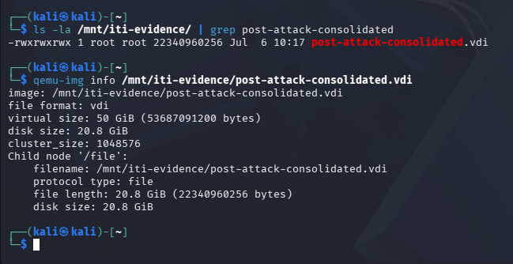
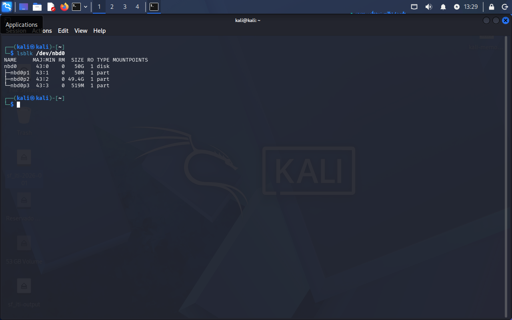
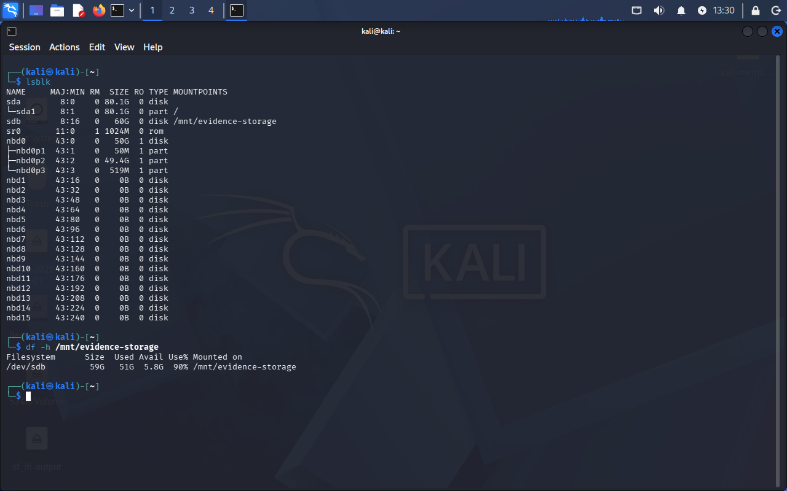
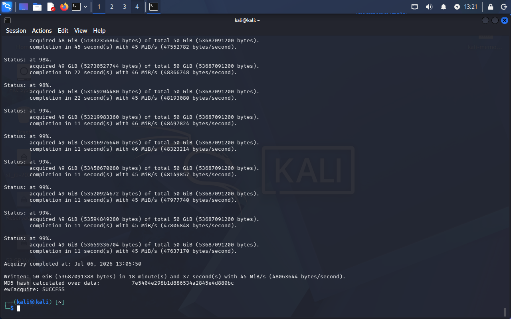
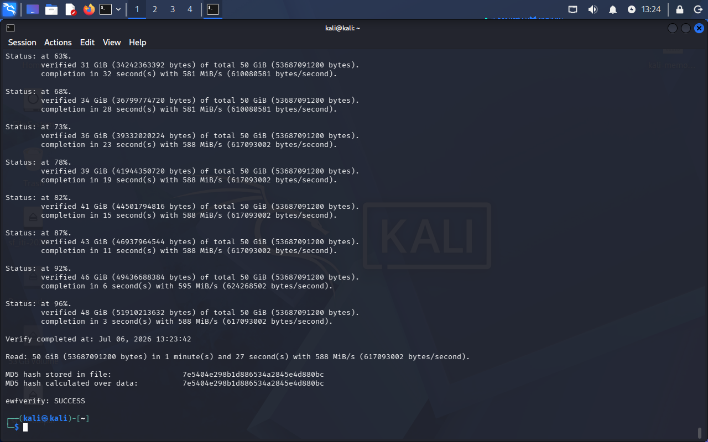
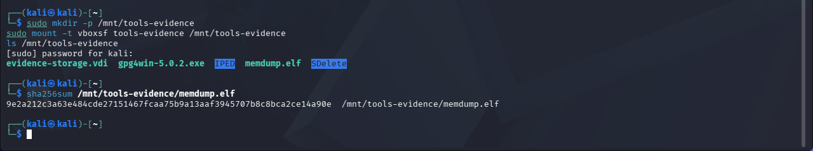
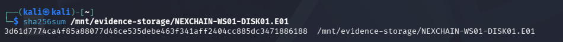

# Phase 02 — Forensic Acquisition

## Objective

Acquire a forensically sound disk image of the target machine's post-attack state, with cryptographic hash verification, establishing the chain of custody for all subsequent analysis phases. The memory dump was already acquired in Phase 00, immediately before shutdown; this phase focuses on disk acquisition.

---

## Step 1 — Resolving the Snapshot Chain

VirtualBox stores differential snapshots as a chain of dependent VDI files — evidence generated after a snapshot lives in the newest differential disk, not in the base VDI. This was a lesson already learned and documented during the BitTorrent DFIR investigation (BTD-2026-001), and it applied here as well.

Inspecting the `.vbox` file confirmed the disk chain:

```
windows-10-dfir-target_.vdi                              (base)
  └── Snapshots/{a7f1ed58-...}.vdi                        (after "clean-install")
        └── Snapshots/{8a414448-...}.vdi                  (after "post-attack")
```

The `post-attack` snapshot corresponds to the top of this chain (`{8a414448-...}.vdi`). Rather than working with the fragile differential files directly, the full chain was consolidated into a single, independent VDI using `VBoxManage clonemedium`, run from the host:

```powershell
& "C:\Program Files\Oracle\VirtualBox\VBoxManage.exe" clonemedium disk "{8a414448-73f2-4166-b7ea-f94814d33f5c}" "C:\Tools\post-attack-consolidated.vdi" --format VDI
```

Result: `post-attack-consolidated.vdi`, 22,340,960,256 bytes (~20.8 GiB actual data on a 50 GiB virtual disk).

This clone was made accessible to the Kali investigator VM via a **read-only** VirtualBox shared folder, protecting the original evidence chain from any accidental modification during acquisition:

```bash
qemu-img info /mnt/iti-evidence/post-attack-consolidated.vdi
```



---

## Step 2 — Direct Block-Device Access via qemu-nbd

Rather than converting the VDI to a raw file first (which would require 50 GiB of scratch space), the consolidated VDI was mounted directly as a read-only block device using `qemu-nbd`. This is closer to how professional acquisition tools handle source media, and `ewfacquire` can read directly from a block device.

```bash
sudo modprobe nbd max_part=8
sudo qemu-nbd --read-only -c /dev/nbd0 /mnt/iti-evidence/post-attack-consolidated.vdi
lsblk /dev/nbd0
```



The three partitions (50 MiB EFI/reserved, 49.4 GiB main NTFS, 519 MiB recovery) match the layout already documented in Phase 01.

---

## Step 3 — Troubleshooting: Shared Folder I/O Instability

The first two acquisition attempts, targeting the VirtualBox shared folder as the output destination, failed partway through:

**Attempt 1** — default 1.4 GiB segment size, failed at ~2% while writing the second segment file:

```
Acquiry failed at: Jul 06, 2026 11:31:05
Unable to acquire input.
libewf_segment_file_write_chunk: unable to write chunk: 44017 data.
```

**Attempt 2** — single 60 GiB segment (ruling out segment-boundary issues), failed again at ~7%:

```
Acquiry failed at: Jul 06, 2026 12:30:00
Unable to acquire input.
libewf_segment_file_write_chunk: unable to write chunk: 120701 data.
```

Free space on the shared folder was not the cause (278 GiB available). The consistent pattern — failure mid-write regardless of segment size — pointed to instability in the `vboxsf` shared-folder protocol under sustained, high-volume write operations, rather than a configuration or space problem.

**Resolution:** a dedicated 60 GiB virtual disk was created and attached directly to the Kali investigator VM (local block storage, bypassing the shared-folder layer entirely for writes):

```powershell
& "C:\Program Files\Oracle\VirtualBox\VBoxManage.exe" createmedium disk --filename "C:\Tools\evidence-storage.vdi" --size 61440 --format VDI
& "C:\Program Files\Oracle\VirtualBox\VBoxManage.exe" controlvm "kali-linux-2026.1-virtualbox-amd64" poweroff
& "C:\Program Files\Oracle\VirtualBox\VBoxManage.exe" storagectl "kali-linux-2026.1-virtualbox-amd64" --name "SATA" --portcount 2
& "C:\Program Files\Oracle\VirtualBox\VBoxManage.exe" storageattach "kali-linux-2026.1-virtualbox-amd64" --storagectl "SATA" --port 1 --device 0 --type hdd --medium "C:\Tools\evidence-storage.vdi"
```

Formatted and mounted inside Kali:

```bash
sudo mkfs.ext4 /dev/sdb
sudo mkdir -p /mnt/evidence-storage
sudo mount /dev/sdb /mnt/evidence-storage
```



This local disk became the acquisition destination for all subsequent attempts, resolving the I/O failures entirely.

---

## Step 4 — Disk Acquisition (E01)

With the source (`/dev/nbd0`, read-only) and destination (`/mnt/evidence-storage`, local ext4) both stable, the acquisition was run with `ewfacquire`:

```bash
sudo ewfacquire /dev/nbd0
```

| Parameter | Value |
|---|---|
| Image path | `/mnt/evidence-storage/NEXCHAIN-WS01-DISK01.E01` |
| Case number | ITI-2026-001 |
| Description | NexChain Exchange - Insider Threat - Disk Image post-attack |
| Evidence number | DISK01 |
| Examiner name | Paulo Vaz |
| EWF file format | EnCase 6 (.E01) |
| Compression | deflate, none |
| Bytes acquired | 50 GiB (53,687,091,200 bytes) |

Acquisition completed in 18 minutes and 37 seconds at ~45 MiB/s (compared to ~7–12 MiB/s on the shared folder before it failed) — confirming the local-disk destination resolved the throughput and stability issue.

```
Acquiry completed at: Jul 06, 2026 13:05:50
Written: 50 GiB (53687091388 bytes) in 18 minute(s) and 37 second(s) with 45 MiB/s (48063644 bytes/second).
MD5 hash calculated over data:          7e5404e298b1d886534a2845e4d880bc
ewfacquire: SUCCESS
```



---

## Step 5 — Integrity Verification

The acquired E01 image was independently verified against its stored hash using `ewfverify`:

```bash
sudo ewfverify /mnt/evidence-storage/NEXCHAIN-WS01-DISK01.E01
```

```
Verify completed at: Jul 06, 2026 13:23:42
Read: 50 GiB (53687091200 bytes) in 1 minute(s) and 27 second(s) with 588 MiB/s (617093002 bytes/second).
MD5 hash stored in file:                7e5404e298b1d886534a2845e4d880bc
MD5 hash calculated over data:          7e5404e298b1d886534a2845e4d880bc
ewfverify: SUCCESS
```



The MD5 hash stored in the E01 metadata matches the hash independently recalculated from the acquired data, confirming the image was written without corruption.

---

## Step 6 — SHA-256 Hashing

`ewfacquire`/`ewfverify` only compute MD5 by default. To meet a stronger dual-hash standard for the chain of custody, SHA-256 was independently calculated for both the disk image (this phase) and the memory dump (Phase 00), run on the Kali investigator VM:

```bash
sha256sum /mnt/tools-evidence/memdump.elf
```
```
9e2a212c3a63e484cde27151467fcaa75b9a13aaf3945707b8c8bca2ce14a90e  memdump.elf
```



```bash
sha256sum /mnt/evidence-storage/NEXCHAIN-WS01-DISK01.E01
```
```
3d61d7774ca4f85a88077d46ce535debe463f341aff2404cc885dc3471886188  NEXCHAIN-WS01-DISK01.E01
```



These SHA-256 values, together with the MD5 already produced by `ewfacquire`/`ewfverify`, are recorded in [`chain-of-custody.md`](../chain-of-custody.md).

---

## Acquisition Summary

| Item | Value |
|---|---|
| Source | Consolidated clone of `post-attack` snapshot (VirtualBox differential chain) |
| Acquisition method | Direct block-device read via `qemu-nbd`, `ewfacquire` |
| Image format | EnCase 6 (.E01) |
| Image size | 50 GiB (53,687,091,200 bytes) |
| MD5 hash | `7e5404e298b1d886534a2845e4d880bc` |
| SHA-256 hash | `3d61d7774ca4f85a88077d46ce535debe463f341aff2404cc885dc3471886188` |
| Verification | ✅ Passed — hash matches |
| Acquisition destination | Dedicated local disk (`/mnt/evidence-storage`), not shared folder |
| Total acquisition time | 18 min 37 sec |
| Verification time | 1 min 27 sec |

---

## Lessons Learned

- **Snapshot chains require consolidation before acquisition.** Working directly with differential VDIs risks corrupting dependencies between them; `VBoxManage clonemedium` safely resolves the full chain into one independent file.
- **VirtualBox shared folders (`vboxsf`) are unreliable for sustained large writes.** Two acquisition attempts failed mid-write at different completion percentages with different segment-size configurations, ruling out space or segment-boundary causes. A dedicated, locally attached virtual disk resolved the issue and improved throughput roughly 4–6x.
- **Direct block-device access (`qemu-nbd`) avoids unnecessary intermediate files.** Converting to raw first would have required 50 GiB of scratch space upfront (and failed once already due to insufficient space); acquiring directly from the NBD device made this unnecessary.

---

*Phase 02 — ITI-2026-001 — NexChain Exchange Insider Threat Investigation*

**Next:** [Phase 03 — Memory Analysis](../phase03-memory-analysis/README.md)
