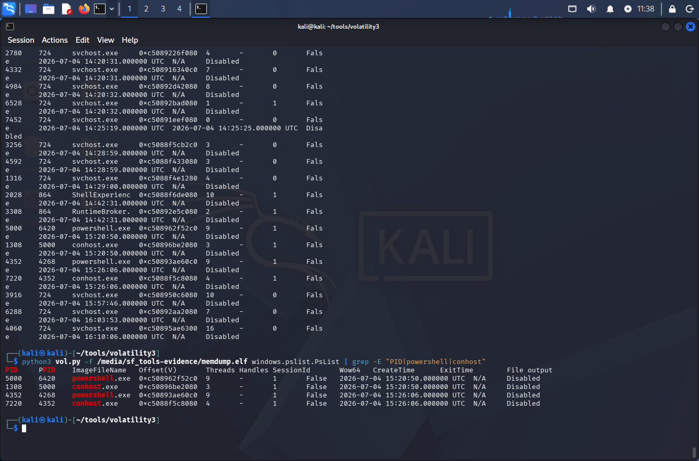
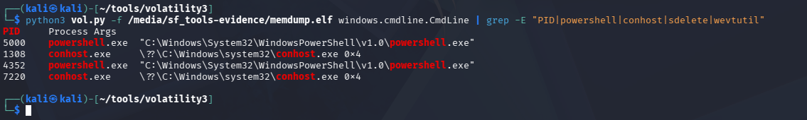
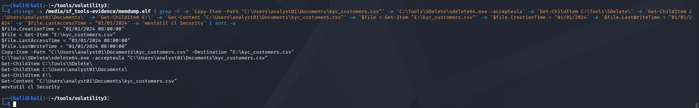
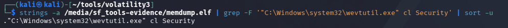
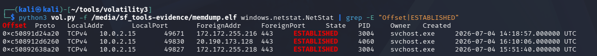
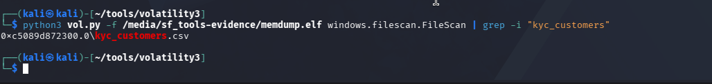

# Phase 03 — Memory Analysis

## Objective

Analyze the memory dump (`memdump.elf`, 8.7 GiB) acquired in Phase 00, using Volatility 3, to recover evidence of the attacker's actions that may still exist in RAM — even though the anti-forensic tools involved (SDelete, `wevtutil`) had already finished executing by the time the dump was captured.

---

## Step 1 — System Identification and Symbol Resolution

Volatility 3 requires the correct Windows kernel symbols (PDB) to interpret the raw memory layout for the specific OS build captured. This is resolved automatically on first use against a new dump.

```bash
cd ~/tools/volatility3
python3 vol.py -f /media/sf_tools-evidence/memdump.elf windows.info.Info
```

The scan confirmed the target as Windows 10 (build 19041, matching the LTSC 21H2 documented in Phase 01), 4 CPUs, and a `SystemTime` of `2026-07-04 16:10:21 UTC` — the moment the dump was captured, used later to cross-reference against the sealed attacker log.

This step downloads and caches the matching symbol table locally; subsequent commands against the same dump reuse the cache and run significantly faster.

---

## Step 2 — Process List

```bash
python3 vol.py -f /media/sf_tools-evidence/memdump.elf windows.pslist.PsList
```

Filtered to the relevant entries:

```bash
python3 vol.py -f /media/sf_tools-evidence/memdump.elf windows.pslist.PsList | grep -E "PID|powershell|conhost"
```



Two distinct PowerShell sessions were active at the time of capture:

| PID | PPID | Process | CreateTime (UTC) |
|---|---|---|---|
| 5000 | 6420 | `powershell.exe` | 15:20:50 |
| 1308 | 5000 | `conhost.exe` | 15:20:50 |
| 4352 | 4268 | `powershell.exe` | 15:26:06 |
| 7220 | 4352 | `conhost.exe` | 15:26:06 |

The second session (PID 4352) was spawned by `explorer.exe` (PID 4268) — the expected parent for a manually opened terminal. The first session's parent (PID 6420, a `RuntimeBroker.exe`) is atypical and was noted for awareness, though it did not lead to further findings in this phase.

Neither `sdelete64.exe` nor `wevtutil.exe` appear in the process list — both had already exited by the time the dump was taken, consistent with their short execution time.

---

## Step 3 — Command-Line Arguments

```bash
python3 vol.py -f /media/sf_tools-evidence/memdump.elf windows.cmdline.CmdLine | grep -E "PID|powershell|conhost|sdelete|wevtutil"
```



Both PowerShell sessions were launched with no arguments (`"powershell.exe"`, no parameters) — confirming that all attacker commands (file copy, SDelete, `wevtutil`, timestomping) were typed interactively within the session, rather than passed at launch. This meant `cmdline` alone would not recover the commands; a broader memory string search was needed.

---

## Step 4 — Recovering the Command History from Memory

A direct string search across the entire memory dump was run to look for surviving fragments of the attacker's interactive PowerShell session — specifically, the PSReadLine console history buffer, which PowerShell keeps in memory while a session is active.

An initial broad search (`sdelete`/`wevtutil`) returned mostly unrelated Windows kernel function names (`WindowsDeleteString`, `ClfsDeleteMarshallingArea`, etc.) sharing the word "delete" — expected noise when grepping raw memory strings. Refining the search to the specific commands used in Phase 00 isolated the real evidence:

```bash
strings -a /media/sf_tools-evidence/memdump.elf | grep -F \
  -e 'Copy-Item -Path "C:\Users\analyst01\Documents\kyc_customers.csv"' \
  -e 'C:\Tools\SDelete\sdelete64.exe -accepteula' \
  -e 'Get-ChildItem C:\Tools\SDelete\' \
  -e 'Get-ChildItem C:\Users\analyst01\Documents\' \
  -e 'Get-ChildItem E:\' \
  -e 'Get-Content "C:\Users\analyst01\Documents\kyc_customers.csv"' \
  -e '$file = Get-Item "E:\kyc_customers.csv"' \
  -e '$file.CreationTime = "01/01/2024' \
  -e '$file.LastWriteTime = "01/01/2024' \
  -e '$file.LastAccessTime = "01/01/2024' \
  -e 'wevtutil cl Security' | sort -u
```



**This is the key finding of Phase 03.** Eleven distinct command lines were recovered directly from RAM, reconstructing almost the entire attacker session:

```
Copy-Item -Path "C:\Users\analyst01\Documents\kyc_customers.csv" -Destination "E:\kyc_customers.csv"
C:\Tools\SDelete\sdelete64.exe -accepteula "C:\Users\analyst01\Documents\kyc_customers.csv"
Get-ChildItem C:\Tools\SDelete\
Get-ChildItem C:\Users\analyst01\Documents\
Get-ChildItem E:\
Get-Content "C:\Users\analyst01\Documents\kyc_customers.csv"
$file = Get-Item "E:\kyc_customers.csv"
$file.CreationTime = "01/01/2024 08:00:00"
$file.LastWriteTime = "01/01/2024 08:00:00"
$file.LastAccessTime = "01/01/2024 08:00:00"
wevtutil cl Security
```

This matches, command for command, the sealed attacker log from Phase 00 — recovered here independently, from volatile memory, without ever decrypting that log. It demonstrates that even though the original file was securely deleted from disk and the Security event log was cleared, the interactive console history survived in RAM until the machine was shut down.

A second, isolated search confirmed the exact executable path used to clear the event log, likely retained from a Prefetch/AMCache-related in-memory cache:

```bash
strings -a /media/sf_tools-evidence/memdump.elf | grep -F '"C:\Windows\system32\wevtutil.exe" cl Security' | sort -u
```



---

## Step 5 — Network Connections

```bash
python3 vol.py -f /media/sf_tools-evidence/memdump.elf windows.netstat.NetStat | grep -E "Offset|ESTABLISHED"
```



Three established TCP connections were found, all on the **NAT** interface (`10.0.2.15`), none on the isolated host-only network (`192.168.56.101`):

| Local | Remote | Port | Process | Time (UTC) |
|---|---|---|---|---|
| 10.0.2.15 | 172.172.255.216 | 443 | svchost.exe (PID 3004) | 14:18:57 |
| 10.0.2.15 | 172.172.255.218 | 443 | svchost.exe (PID 3004) | 15:51:40 |
| 10.0.2.15 | 20.190.173.128 | 443 | svchost.exe (PID 4060) | 16:10:06 |

The destination IP ranges belong to Microsoft Azure infrastructure, consistent with routine Windows telemetry/Defender/Update traffic — not with any external exfiltration channel. **No evidence of network-based data exfiltration was found.** This is consistent with the case scenario, which used physical removable media (the simulated USB device) rather than a network channel.

---

## Step 6 — File Scan

```bash
python3 vol.py -f /media/sf_tools-evidence/memdump.elf windows.filescan.FileScan | grep -i "kyc_customers"
```



A single file object reference to `kyc_customers.csv` was found in memory, at offset `0xc5089d872300`. This is consistent with the copy still present on the simulated USB device (`E:\kyc_customers.csv`) at the time of capture. No second reference was recovered corresponding to the original file in `Documents` — expected, since it had been securely overwritten by SDelete well before the memory dump was taken, giving the OS time to release the associated in-memory file object as well.

---

## Findings Summary

| Area | Result |
|---|---|
| Active processes | 2 PowerShell sessions identified (15:20:50 and 15:26:06 UTC) |
| Command-line launch arguments | No arguments — commands were typed interactively |
| Attacker command history | ✅ Recovered — 11 commands, matching the sealed log from Phase 00 |
| Anti-forensic tool execution (SDelete) | ✅ Confirmed via recovered command history |
| Anti-forensic tool execution (wevtutil) | ✅ Confirmed via recovered command history and executable path |
| Network exfiltration | ❌ Not found — only routine Microsoft telemetry traffic on NAT interface |
| File object for `kyc_customers.csv` | ✅ Found (single reference, consistent with the copy on the simulated USB) |

Memory analysis independently corroborated the attacker's actions documented in the sealed log from Phase 00 — without that log ever being decrypted. This will be revisited in Phase 07, when the sealed log is finally opened for a full blind-analysis comparison against everything found across Phases 03–06.

---

*Phase 03 — ITI-2026-001 — NexChain Exchange Insider Threat Investigation*

**Next:** [Phase 04 — Disk Analysis](../phase04-disk-analysis/README.md)
