# Phase 04 — Disk Analysis

## Objective

Analyze the forensic disk image (`NEXCHAIN-WS01-DISK01.E01`, acquired in Phase 02) to independently corroborate the attacker's actions documented in the sealed log from Phase 00 and recovered from memory in Phase 03 — this time from the persistent, non-volatile evidence layer: the file system itself. Specifically, this phase set out to (1) confirm or refute recoverability of the deleted original file, (2) prove the file's prior existence through file-system-level artifacts even where direct recovery failed, (3) determine the true nature of the simulated USB device, (4) recover any surviving command history from disk, and (5) technically verify the timestomping attempt at the NTFS metadata level.

---

## Step 1 — Mounting the Forensic Image

The E01 image cannot be mounted directly by the OS — it is a forensic container format, not a raw disk image. `ewfmount` was used to expose it as a raw block device, and the NTFS partition was then mounted read-only on top of that.

```bash
sudo mount /dev/sdb /mnt/evidence-storage
sudo ewfmount /mnt/evidence-storage/NEXCHAIN-WS01-DISK01.E01 ~/mnt_ewf
sudo mmls ~/mnt_ewf/ewf1
```

The partition table confirmed the same layout already documented in Phase 01/02: a ~50 MiB EFI/reserved partition, the ~49.4 GiB main NTFS partition (offset 104448 sectors → byte offset 53,477,376), and a ~519 MiB recovery partition.

```bash
sudo mkdir -p /mnt/ntfs_analysis
sudo mount -o ro,loop,offset=53477376,show_sys_files,streams_interface=windows -t ntfs-3g ~/mnt_ewf/ewf1 /mnt/ntfs_analysis
```

Mounting was performed **read-only** at every layer (`ewfmount` default, explicit `ro` on the NTFS mount) to guarantee the acquired evidence was never modified during analysis.

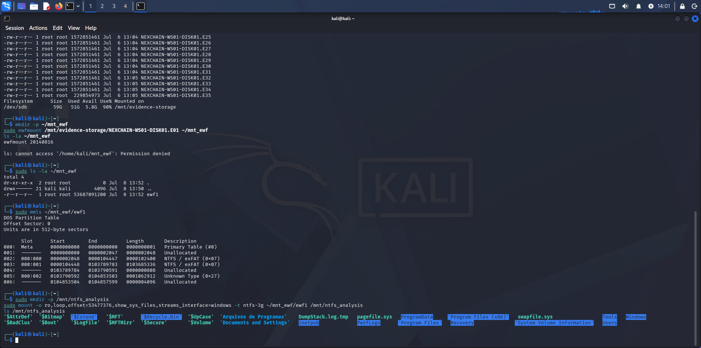

**Note on session persistence:** this mount chain does not survive a VM reboot or shutdown of the Kali investigator machine. It was re-established multiple times throughout this phase (visible in the varying timestamps across screenshots); each remount followed the identical three-command sequence above, with no impact on the underlying evidence.

---

## Step 2 — Confirming the File Is No Longer Visible

Before attempting recovery, the analyst01 Documents folder was inspected directly to confirm the file was absent from the active, visible file system — the expected outcome given SDelete was used in Phase 00.

```bash
ls -la "/mnt/ntfs_analysis/Users/analyst01/Documents/"
```

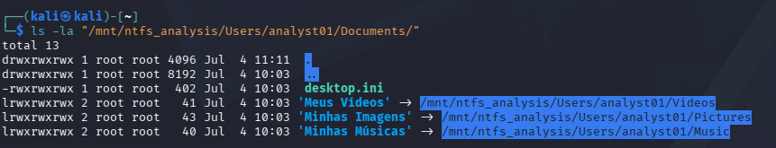

Confirmed: `kyc_customers.csv` does not appear in the folder listing.

---

## Step 3 — Attempting Deleted File Recovery via MFT

**Investigative logic:** a normal file deletion (Recycle Bin, Shift+Delete) typically leaves the MFT (Master File Table) entry intact and marked as free — the entry, and often the content, remains recoverable until overwritten by new data. SDelete is designed specifically to defeat this: it overwrites file content before deletion. The question at this step was whether it also prevented recovery of the MFT *entry itself* (the metadata/name), independent of content recovery.

Three separate attempts were made using `fls` (The Sleuth Kit), each broadening the search:

```bash
sudo fls -o 104448 -r ~/mnt_ewf/ewf1 | grep -i "kyc"
sudo fls -o 104448 ~/mnt_ewf/ewf1 | grep -i "documents"
sudo fls -o 104448 -r -d ~/mnt_ewf/ewf1 | grep -i "documents\|csv"
```

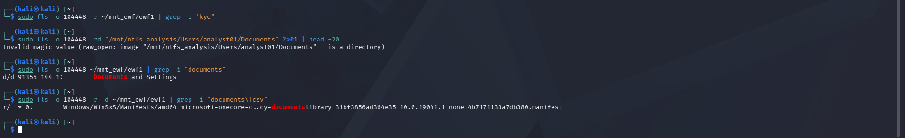

All three returned no matching entry for the file — not even a deleted/orphaned MFT record. This is a stronger anti-forensic result than a typical deletion: SDelete's secure-delete behavior appears to have also cleared or reused the MFT entry itself, not merely the file content. **This negative result was documented as a finding, not treated as a dead end** — it directly informed the decision to pursue the USN Journal next, since the USN Journal is a separate change-tracking mechanism from the MFT and is not affected by MFT entry reuse.

---

## Step 4 — USN Journal: Proving Existence Independent of the MFT

**Investigative logic:** the USN Journal (`$Extend\$UsnJrnl`) is an NTFS change-log mechanism, architecturally separate from the MFT. It records file-system events (create, write, rename, delete) as they happen, independent of whether the associated MFT entry survives. This made it the correct next artifact to check after MFT recovery failed.

```bash
sudo fls -o 104448 ~/mnt_ewf/ewf1 | grep -i '$Extend'
sudo fls -o 104448 ~/mnt_ewf/ewf1 11-144-4
```

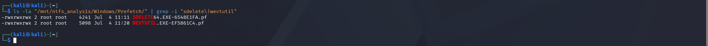

The `$UsnJrnl:$J` data stream (inode `42887-128-3`) was identified and extracted for analysis:

```bash
sudo icat -o 104448 ~/mnt_ewf/ewf1 42887-128-3 > ~/usnjrnl_extracted.bin
```

Result: 389 MB extracted. Rather than parsing the full USN record structure (reason codes, timestamps per entry) — a significantly more time-consuming path with a proper parser — a direct UTF-16LE string search was run first, since Windows records file names in that encoding internally:

```bash
strings -e l ~/usnjrnl_extracted.bin | grep -i "kyc_customers"
```


**10 occurrences** of `kyc_customers.csv` were found. **Decision point:** given this already provided strong, unambiguous proof that the file existed and underwent file-system activity, the more expensive path of decoding individual USN reason codes (which would require installing and configuring a dedicated parser) was deliberately not pursued — the marginal evidentiary gain did not justify the additional time, since the central claim ("the file existed, despite SDelete") was already conclusively supported.

---

## Step 5 — Prefetch: Confirming Tool Execution

**Investigative logic:** Windows Prefetch caches a `.pf` file for every executable run, independent of whether the process is still active or has since exited — making it a reliable, low-cost way to confirm a program actually executed, complementing the process-list evidence already gathered from memory in Phase 03 (where SDelete and wevtutil had already exited and were absent from `pslist`).

```bash
ls -la "/mnt/ntfs_analysis/Windows/Prefetch/" | grep -i "sdelete\|wevtutil"
```

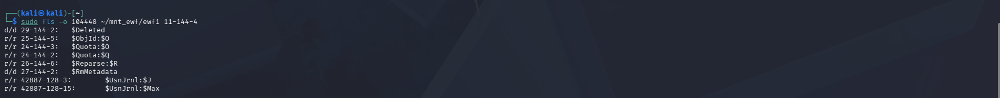

Both `SDELETE64.EXE-6548E1FA.pf` (11:11) and `WEVTUTIL.EXE-EF5861C4.pf` (11:20) were found, confirming execution of both tools independent of any log or memory artifact. **Deeper Prefetch parsing (run count, full embedded path via a dedicated tool) was considered and deliberately skipped** — the execution path was already known from other sources (memory strings, command history below), and the marginal value of a specialized parser did not justify the setup cost at this stage.

---

## Step 6 — Windows Event Log: Security.evtx

The `Security.evtx` and `System.evtx` files were extracted from the image and parsed using `python-evtx` (installed via pip, after `regripper`/`hivexregedit`/`evtx` were found unavailable in the default Kali package set):

```bash
mkdir -p ~/evtx_analysis
sudo cp "/mnt/ntfs_analysis/Windows/System32/winevt/Logs/Security.evtx" ~/evtx_analysis/
sudo cp "/mnt/ntfs_analysis/Windows/System32/winevt/Logs/System.evtx" ~/evtx_analysis/
pip install python-evtx --break-system-packages
python3 ~/parse_evtx.py ~/evtx_analysis/Security.evtx > ~/security_evtx_parsed.xml
```

`Security.evtx` parsed to only 1226 lines — visually small for a log expected to span the machine's active lifetime, itself a preliminary indicator of tampering. Searching specifically for **Event ID 1102** (the event Windows automatically generates whenever the audit log is cleared — a record the attacker cannot suppress without disabling auditing entirely beforehand) confirmed this:

```bash
grep -B5 -A20 "EventID>1102" ~/security_evtx_parsed.xml
```

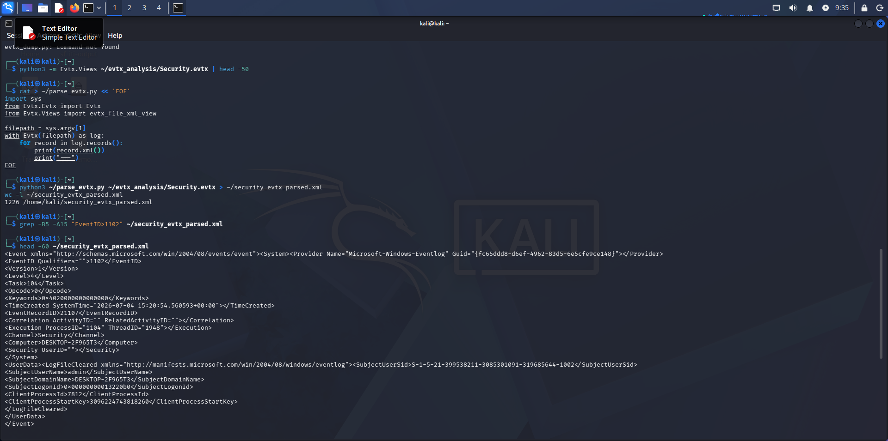

This was, in fact, the **first event in the entire log** — confirming the log had just been reset. It recorded:
- **User:** `admin`
- **Timestamp:** `2026-07-04 15:20:54.560593 UTC`
- **ClientProcessId:** `7812`

This matches the `wevtutil cl Security` action documented in the Phase 00 sealed log and independently corroborates the actor (admin, not analyst01) responsible for that specific step.

**Follow-up check:** since the second PowerShell session (analyst01, 15:26:06 UTC per Phase 03) began *after* the log was cleared, a targeted search was run for Event ID 4688 (process creation) referencing SDelete, to see if its execution had been captured post-clear:

```bash
grep -B5 -A20 "EventID>4688" ~/security_evtx_parsed.xml | grep -A20 "sdelete\|SDelete"
```

No match was found. This is not a gap in the investigation — process-creation auditing (4688) is disabled by default in Windows and was not explicitly enabled during the Phase 01 environment setup, so its absence here is expected and was documented as such rather than treated as inconclusive.

---

## Step 7 — Registry: Determining the Nature of the Simulated USB Device

**Investigative logic — a three-step elimination process:**

**7a. USBSTOR (expected first check, negative result):**
```
cd \ControlSet001\Enum\USBSTOR
```
This key did not exist. USBSTOR is populated only by the USB bus driver, when a device physically enumerates over a USB controller (or true USB passthrough in VirtualBox). Its absence ruled out a physical/passthrough USB device — but on its own, does not yet prove *what* the device actually was.

**7b. MountedDevices (confirms drive-letter assignment, regardless of bus type):**
```
cd \MountedDevices
lsval
```
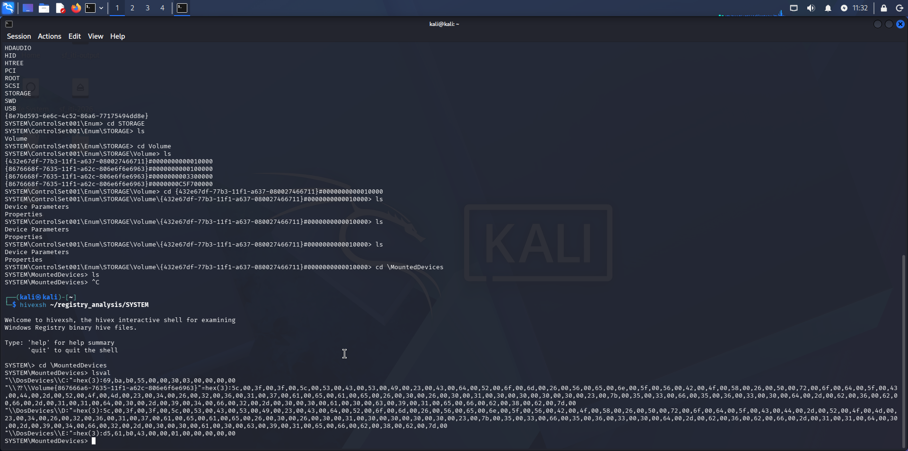

`\DosDevices\E:` was found, mapped to a disk-signature value structurally different from the SCSI/CD-ROM path format seen for `C:` and `D:`. MountedDevices is populated by the volume mount manager, which operates above the physical bus layer — it records any device assigned a drive letter, regardless of how it was attached. This confirmed `E:` was a real, distinct disk, but still not definitively *which kind*.

**7c. SCSI (the artifact that closed the loop):**
```
cd \ControlSet001\Enum\SCSI
ls
```
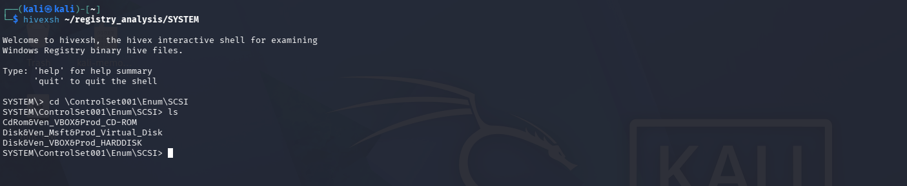

Three entries were found:
- `CdRom&Ven_VBOX&Prod_CD-ROM` — the Guest Additions virtual CD-ROM
- `Disk&Ven_VBOX&Prod_HARDDISK` — the VM's main disk, emulated as hardware by VirtualBox (vendor: VBOX)
- **`Disk&Ven_Msft&Prod_Virtual_Disk`** — a disk whose reported vendor is **Microsoft**, not VirtualBox

This is the decisive artifact: the vendor string in a SCSI enumeration entry reflects who created the device at the point of attachment. A device emulated by the hypervisor reports as `VBOX`; a virtual disk created and mounted by the Windows Virtual Disk Service (the mechanism behind `diskpart create vdisk` / `attach vdisk`, used in Phase 00) reports as `Msft`. The presence of this entry — combined with the complete absence of any USBSTOR entry — conclusively demonstrates the "USB pendrive" was a VHD attached internally via the OS, not a physical or passthrough USB device.

---

## Step 8 — Registry: UserAssist (Programs Launched via GUI)

```
cd \Software\Microsoft\Windows\CurrentVersion\Explorer\UserAssist\{CEBFF5CD-ACE2-4F4F-9178-9926F41749EA}\Count
lsval
```

Value names in this key are ROT13-encoded. Decoding the relevant entries:

| Encoded | Decoded |
|---|---|
| `pzq.rkr` | `cmd.exe` |
| `zfcnvag.rkr` | `mspaint.exe` |
| `FavccvatGbby.rkr` | `SnippingTool.exe` |
| `JvaqbjfCbjreFuryy\v1.0\cbjrefuryy.rkr` | `WindowsPowerShell\v1.0\powershell.exe` |

PowerShell, cmd, and SnippingTool (used to capture the evidence screenshots) all appear — confirming these were launched via Explorer/Start Menu. **`sdelete64.exe` and `wevtutil.exe` do not appear**, which is expected and consistent, not a gap: UserAssist only records programs launched through the Explorer shell. Both tools were invoked as commands *inside* an already-open PowerShell session, so they never passed through the shell layer UserAssist monitors — only the PowerShell session itself (the entry point) was captured.

---

## Step 9 — Registry: ShellBags (GUI Folder Navigation)

```
cd \Software\Microsoft\Windows\Shell\BagMRU
ls
cd \Software\Microsoft\Windows\Shell
ls
```

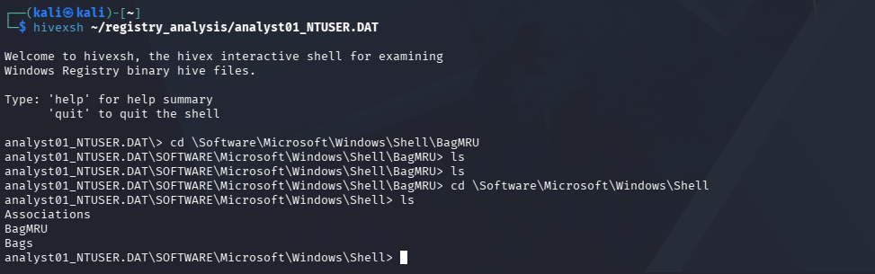

The `Shell` key exists with `BagMRU` and `Bags` subkeys, but both are **empty** — no folder navigation history was recorded. This negative result is itself evidence: it confirms the attacker never opened File Explorer to browse to `Documents` or `E:\` visually, consistent with the command-line-only behavior pattern already observed across every other artifact in this investigation (Phase 03 memory analysis, and the command histories below).

---

## Step 10 — ConsoleHost_history.txt: Command History Recovered from Disk

**Investigative logic:** PowerShell's PSReadLine module persists console input history to disk, per user profile, independent of the process's memory state — unlike the memory-based reconstruction in Phase 03 (volatile, dependent on capture timing, required filtering out unrelated noise), this file is a native, persistent, first-hand record written automatically by the shell itself.

```bash
find /mnt/ntfs_analysis/Users/analyst01/ -iname "ConsoleHost_history.txt"
find /mnt/ntfs_analysis/Users/admin/ -iname "ConsoleHost_history.txt"
```

Both were found and read directly:

**analyst01** — full session reconstructed, including the SDelete download/setup, both CSV-creation attempts (one failed on syntax, the second succeeded — the error itself preserved), the copy to `E:\`, the SDelete execution, and the complete three-line timestomping block:

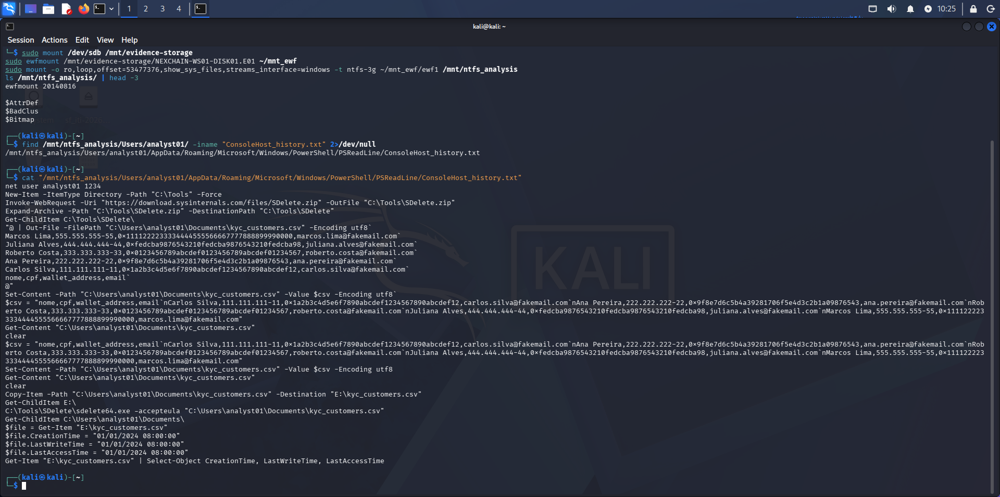

**admin** — only two lines: `diskpart` (the VHD creation session) and `wevtutil cl Security` (the log-clearing action):

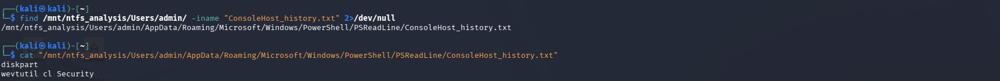

Having two separate history files, one per user profile, allowed each action to be attributed to a specific account — reconstructing not just *what* happened, but *who* performed each step, which matters directly for an insider-threat case built on establishing individual accountability.

**Evidentiary significance:** this is considered the strongest single artifact recovered in this phase. Unlike memory (volatile, lost on shutdown, required reconstruction via string filtering) or the USN Journal (proves file activity but not the exact command), this is a persistent, unmediated, first-party record — the shell writing exactly what was typed, with no interpretation or reconstruction required from the investigator. It also serves as the direct comparison baseline for Phase 07's blind-analysis review against the sealed attacker log.

---

## Step 11 — $STANDARD_INFORMATION vs $FILE_NAME: Verifying Timestomping at the File-System Level

**Investigative logic:** every prior finding (the sealed log, the memory strings, the ConsoleHost_history) proves the timestomping *command was run* — but none of them, on their own, prove its *effect survived at the file-system structure level*. NTFS maintains two independent timestamp records per file: `$STANDARD_INFORMATION` ($SI, easily modified via common OS APIs — this is what Explorer/PowerShell display) and `$FILE_NAME` ($FN, stored in the parent directory's index and not exposed to the same easy modification path). A discrepancy between the two is close to definitive proof of timestamp tampering, independent of any log or memory evidence — it would remain detectable even if every other artifact in this investigation had been destroyed.

Since the file's current copy resides inside `pendrive.vhd` (nested inside the acquired disk image, at `C:\Tools\pendrive.vhd`), a second, nested mount was required:

```bash
mkdir -p ~/vhd_analysis
sudo cp /mnt/ntfs_analysis/Tools/pendrive.vhd ~/vhd_analysis/
sudo mmls ~/vhd_analysis/pendrive.vhd
sudo fls -o 128 -r ~/vhd_analysis/pendrive.vhd | grep -i "kyc"
sudo istat -o 128 ~/vhd_analysis/pendrive.vhd 38
```

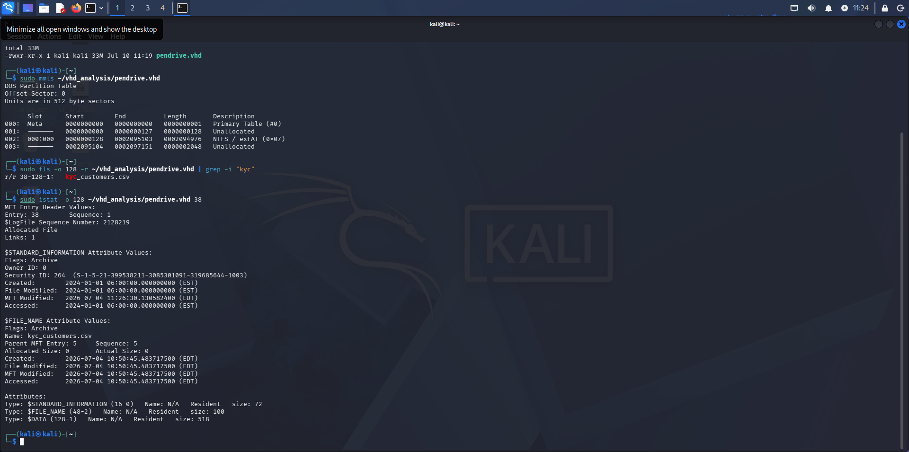

| Attribute | $STANDARD_INFORMATION (displayed to user) | $FILE_NAME (real, directory index) |
|---|---|---|
| Created | **2024-01-01 06:00:00** (falsified) | **2026-07-04 10:50:45** (actual) |
| Modified | **2024-01-01 06:00:00** (falsified) | **2026-07-04 10:50:45** (actual) |
| Accessed | **2024-01-01 06:00:00** (falsified) | **2026-07-04 10:50:45** (actual) |

This is the textbook signature of timestomping. Notably, the `$SI`'s **MFT Modified** field (`2026-07-04 11:26:30`) — a value updated automatically by the file system whenever the MFT entry changes, and not directly settable via the PowerShell timestamp-assignment technique used — retained the real timestamp of the timestomping action itself, providing an additional, independent corroboration point.

---

## Findings Summary

| Artifact | Result | Significance |
|---|---|---|
| Documents folder listing | File absent | Confirms deletion at the active file-system level |
| MFT (`fls`, 3 attempts) | No trace recovered | SDelete defeated even MFT-level name/entry recovery — stronger than typical deletion |
| USN Journal | 10 occurrences of filename | Proves file existence/activity independent of the MFT |
| Prefetch | SDELETE64.EXE and WEVTUTIL.EXE both present | Confirms execution of both anti-forensic tools |
| Security.evtx — Event ID 1102 | Found — admin, 15:20:54 UTC | Automatic, unavoidable record of the log-clearing action itself |
| Security.evtx — Event ID 4688 | Not found | Expected — process-creation auditing not enabled in this environment |
| Registry — USBSTOR | Empty/absent | Rules out physical/passthrough USB |
| Registry — MountedDevices | E: present, distinct disk signature | Confirms E: is a real, separately-attached disk |
| Registry — SCSI | `Disk&Ven_Msft&Prod_Virtual_Disk` | Proves the device was an OS-created virtual disk, not hypervisor-emulated hardware |
| Registry — UserAssist | PowerShell, cmd, SnippingTool present; SDelete/wevtutil absent | Confirms GUI-launched entry points; absence of the tools themselves is expected (launched from an already-open shell) |
| Registry — ShellBags | Empty | Confirms no GUI folder browsing occurred |
| ConsoleHost_history (analyst01) | Full session recovered | Strongest artifact of the phase — persistent, unmediated command record |
| ConsoleHost_history (admin) | `diskpart` + `wevtutil cl Security` recovered | Attributes log-clearing action to the correct account |
| $SI vs $FN (`istat`) | Confirmed discrepancy | Structural, file-system-level proof of timestomping, independent of any log/memory source |

---

## Methodology Notes

- **Every negative result was pursued to its logical conclusion rather than treated as a dead end.** Failure to recover the file via MFT led directly to the USN Journal; absence of USBSTOR led to MountedDevices, then SCSI, to positively identify the device type rather than stop at "not USB."
- **Cost/benefit judgment was applied deliberately at several points** — full USN Journal reason-code parsing and deep Prefetch metadata extraction were both considered and consciously skipped once the available lower-effort evidence already supported the required conclusion beyond reasonable doubt.
- **Two independent PowerShell histories (per user account) allowed action-level attribution**, not just a flat list of what happened — critical for an insider-threat case where establishing *who* performed each action matters as much as *what* occurred.
- All analysis was performed against read-only mounts of the acquired image; the original E01 and its hashes remain unaffected.

---

*Phase 04 — ITI-2026-001 — NexChain Exchange Insider Threat Investigation*

**Next:** [Phase 05 — Anti-Forensic Analysis](../phase05-anti-forensic-analysis/README.md)
