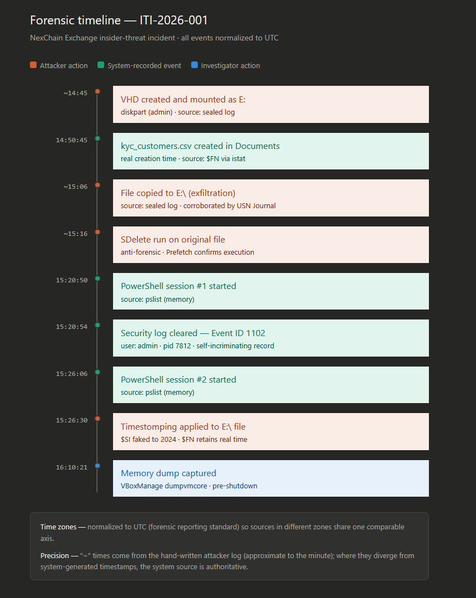

# Phase 06 — Timeline Reconstruction

## Objective

Consolidate every timestamped event collected across Phases 01, 03, 04, and 05 into a single, unified chronological timeline, cross-referencing artifacts from three independent evidence layers — memory, disk, and the Windows event log — into one coherent sequence. This phase does not generate new evidence; it correlates and normalizes what was already recovered, in line with **ISO/IEC 27042** (analysis and interpretation of digital evidence), for which reliable temporal correlation across heterogeneous sources is a core concern.

---

## The Time Normalization Problem

The evidence in this case originated from sources recording time in three different reference frames:

| Source | Time reference | Why |
|---|---|---|
| Sealed attacker log (host) | BRT (UTC-3) | Written manually on the Brazilian host machine |
| Event Log, Volatility (`pslist`, `windows.info`) | UTC | Windows event logs and memory structures store/report in UTC natively |
| The Sleuth Kit (`istat`) | EDT (UTC-4) | TSK rendered the NTFS timestamps in the tool's configured local zone |

To place all events on one comparable axis, **every timestamp was normalized to UTC** — the standard reference frame for forensic reporting, which removes ambiguity when correlating events that were originally recorded in different zones.

### Validation of the conversion

The correctness of the zone offsets was verified using a cross-source anchor: the `wevtutil cl Security` action.

- Sealed attacker log (BRT): **12:21**
- Event ID 1102, the Windows-generated record of that same action (UTC): **15:20:54**
- Difference: **~3 hours**, confirming BRT = UTC-3.

Because the same event was captured independently by two sources in two different zones, their agreement (once offset) confirms the normalization is sound.

---

## Unified Timeline (Auditable)

All events normalized to UTC. Original local time and source zone are retained alongside for full traceability.

| # | UTC | Original | Source zone | Event | Evidence source | Type |
|---|-----|----------|-------------|-------|-----------------|------|
| 1 | ~14:45 | 11:45 | BRT (UTC-3) | VHD created and mounted as E: | Sealed log | Attacker action |
| 2 | 14:50:45 | 10:50:45 | EDT (UTC-4) | `kyc_customers.csv` created in Documents | `$FN` via `istat` | System event |
| 3 | ~15:06 | 12:06 | BRT (UTC-3) | File copied to `E:\` (exfiltration) | Sealed log | Attacker action |
| 4 | ~15:16 | 12:16 | BRT (UTC-3) | SDelete run on original file | Sealed log | Attacker action |
| 5 | 15:20:50 | 15:20:50 | UTC | PowerShell session #1 started | `pslist` (memory) | System event |
| 6 | 15:20:54 | 15:20:54 | UTC | Security log cleared — Event ID 1102 | Event Log | System event |
| 7 | 15:26:06 | 15:26:06 | UTC | PowerShell session #2 started | `pslist` (memory) | System event |
| 8 | 15:26:30 | 11:26:30 | EDT (UTC-4) | Timestomping applied (MFT Modified) | `istat` `$SI` | Attacker action |
| 9 | 16:10:21 | 16:10:21 | UTC | Memory dump captured (pre-shutdown) | `windows.info` | Investigator action |

### Notes on the timeline

**Dual timestamps for traceability.** Both the normalized UTC value and the original local time (with its source zone) are shown for every event, so any reviewer can independently verify each conversion rather than having to trust it.

**Precision hierarchy.** Times marked "~" derive from the hand-written attacker log, recorded manually and approximate to the minute. Where they diverge slightly from system-generated timestamps (Event Log, `pslist`, `istat` — all precise to the second), the system source is treated as authoritative. The manual log establishes sequence and intent; the system artifacts establish exact timing.

**Multiple time references are normal in forensic work — not a sign of error.** Note that artifacts from the *same* Windows system surface in different zones here: the Event Log and `pslist` in UTC, but `istat` in EDT. This reflects how different subsystems store and how different tools render time, not a clock inconsistency. In real investigations this is the rule rather than the exception — a case routinely spans multiple devices, each with its own clock (potentially drifted or misconfigured) and its own configured zone. Recognizing this and normalizing to a single reference frame is precisely why time normalization is treated as a distinct analytical step under **ISO/IEC 27042**, rather than something assumed to be trivial.

---

## Visual Timeline

The consolidated sequence, rendered visually — attacker actions in coral, system-recorded events in teal, investigator action in blue. The color banding makes the anti-forensic cluster (15:16–15:26 UTC) immediately visible as a concentrated run of activity.

---

## Reconstructed Attacker Sequence

Reading the timeline as a narrative, the insider's operation reconstructs cleanly:

1. **Preparation** (~14:45) — the attacker, using the elevated `admin` account, creates and mounts a VHD as drive `E:` to act as the exfiltration medium.
2. **Data staging** (14:50:45) — back on the `analyst01` account, the KYC dataset is created in the user's Documents folder.
3. **Exfiltration** (~15:06) — the KYC file is copied to `E:\`.
4. **Anti-forensics begins** (~15:16 onward) — a tight cluster of concealment actions follows: SDelete destroys the original file, then (15:20:54) the Security event log is cleared under the `admin` account, and finally (15:26:30) the exfiltrated copy's timestamps are falsified to 2024.
5. **Evidence capture** (16:10:21) — from the investigator's side, the memory dump is taken before shutdown, freezing the volatile state that would later yield the PowerShell command history.

The concentration of all three anti-forensic techniques into a ~10-minute window (15:16–15:26 UTC) is itself an analytical observation: it reflects a deliberate "clean-up" phase executed as a distinct stage of the operation, immediately after exfiltration.

---

## Findings Summary

| Item | Result |
|---|---|
| Events correlated across sources | 9, spanning memory + disk + event log |
| Time normalization | All events converted to UTC; conversion validated via cross-source anchor (Event 1102 vs. sealed log) |
| Attacker sequence | Fully reconstructed: preparation → staging → exfiltration → anti-forensics → (investigator) capture |
| Key analytical observation | All three anti-forensic techniques cluster within a ~10-minute window, indicating a discrete clean-up stage |
| Standard applied | ISO/IEC 27042 (analysis and interpretation of digital evidence) |

---

*Phase 06 — ITI-2026-001 — NexChain Exchange Insider Threat Investigation*

**Next:** [Phase 07 — Report and Sealed Log Comparison](../phase07-report/README.md)
